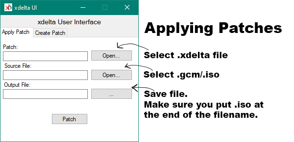
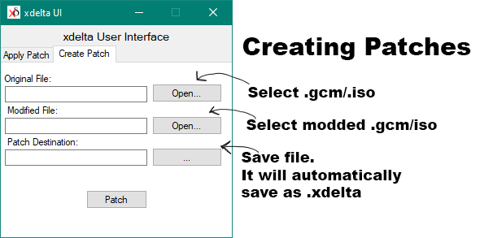

#01 - Patches

For legal reasons, both playing and sharing mods requires the use of a patch system.
Either way, you need to make sure that you have dumped (or acquired) a known-good dump of Luigi's Mansion, which can be done using [Dolphin Emulator.](https://www.lbmwiki.net/tools/dolphin/)

!!! warning "Warning"
	If you intend on modding the PAL version, we highly recommend using PAL 1.01; all of our hosted PAL hacks are based on this version.

=== "Applying Patches"
	
	Make sure that Dolphin knows where your game files are. At the top of the window, choose Options → Configuration → Paths and add the location of your ISO file(s) to this section.
	Back on the main view, right click your game and choose Properties.
	Click on the 'Verify' tab, and at the bottom of the window is a 'Verify Integrity' button.
	If it returns saying it's a 'bad dump', then you must find another clean ISO through other means, we cannot assist you in finding one.
	
		Known good MD5 hashes (courtesy of redump.org):
			NTSC-U 1.00 - 6e3d9ae0ed2fbd2f77fa1ca09a60c494
			NTSC-J 1.00 - 83839f063e42f04147157382dcb019b2
			PAL    1.01 - 109274d9078b5aecf3bfa9af1d10688c

		
	After that, applying the patch is handled by xdelta UI, as shown below:
	
	{ height='400" }
	
	To apply patches, select your .xdelta patch file, then your source ISO or GCM file, and then for the output, manually type in .iso at the end of the filename.

=== "Creating Patches"

	Creating a patch is as follows:
	
	{ height='400" }
	
	To create a patch, select the vanilla, unaltered game ISO, your modded ISO, and then save the file. It will output as a .xdelta file.

		
#[:material-hammer-screwdriver: Home](https://www.lbmwiki.net/tutorials) | [Next :material-arrow-right-bold-box:](02_Recommended_Tools.md) { align=center }